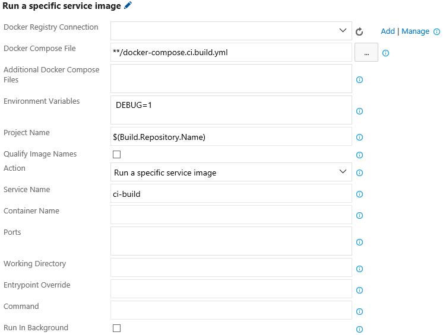

The world's largest enterprises rely on Docker to develop the world’s best applications. With the Docker extension, you can integrate Docker images and containers into your existing agile and DevOps workflows.

The Docker extension adds a task that enables you to build Docker images, push Docker images to an authenticated Docker registry, run Docker images or execute other operations offered by the Docker CLI. It also adds a Docker Compose task that enables you to build, push and run multi-container Docker applications or execute other operations offered by the Docker Compose CLI. Lastly, it offers a Docker Deploy task that enables you to deploy single Docker images or multi-container Docker applications into Azure. 

The Docker extension introduces two new service endpoints for Docker hosts and registries. The tasks default to using a local Docker host if available (this currently requires a custom VSTS agent), otherwise they require a Docker host connection to be provided. Actions that depend on being authenticated with a Docker registry, such as pushing an image, require a Docker registry connection to be provided.

### Requirements
  * Visual Studio Team Services is required, or for on-premises installations, Team Foundation Server 2015 Update 3 or later.
  * A VSTS agent that has the Docker binaries. An easy way to create one of these is to use Docker to run the VSTS agent. See [https://hub.docker.com/r/microsoft/vsts-agent] for more information.

## Build Docker Images
Build a Dockerfile into an image with a registry-qualified name and multiple tags such as the build ID, source branch name and Git tags:


## Push Docker Images
Push Docker images with multiple tags to an authenticated Docker Registry and save the resulting repository image digest to a file:


> NOTE: As opposed to Docker name:tag references, which may change over time, a repository image digest provides the immutable identifier of an image in a registry that can be used to guarantee the same image binary is identified in subsequent tasks such as a release through multiple environments.

## Run Docker Images
Perform isolated workloads inside a container by running a Docker image. For instance, a repository that contains a Node.js application can install a set of node modules into the repository using the node:argon image:


A Docker image can also be run in the background with a specific restart policy:


> NOTE: If a Docker image is run in the background as part of a build, say for running tests, a subsequent task should be used to stop the container so that it does not persist beyond the lifetime of the build. This task should set its control options to "Continue on error" and "Always run" to ensure that even if another task fails, it still stops and removes the running container.

## Run Docker commands
Issue arbitrary Docker commands, such as stopping and removing containers that were previously started using the "Run an image" action:


## Multi-Container Docker Applications
A multi-container Docker application is a set of related services that are built, pushed and run as a group. They are defined using one or more docker-compose.yml files which can be combined together in a particular order to produce an effective configuration.

### Build Service Images
Build service images specified in a docker-compose.yml file with registry-qualified names and additional tags such as the build ID, source branch name or Git tags:


### Push Service Images
Push service images specified in a docker-compose.yml file, with multiple tags, to an authenticated Docker Registry:


### Run Service Images
Run services images specified in a docker-compose.yml file in an isolated environment to enable workloads such as integration testing:


In this example, the docker-compose.test.yml file, which sits alongside the identified docker-compose.yml file, contains an additional integration test service that performs its testing by calling into the other services defined in the original docker-compose.yml file. By unchecking "Run In Background" and checking "Abort on Container Exit", the task runs until the test container exits. If "Run In Background" is checked, the services remain up for additional tasks that may want to call into the running services. In this case, an additional task can be used to bring down the running services (see the section about issuing arbitrary Docker Compose commands).

### Run a Specific Service Image
Run a specific service image specified in a docker-compose.yml file with its dependencies in an isolated environment:



In this example, the docker-compose.ci.build.yml file describes how to run a ci-build service that performs a set of compilation steps in the repository. The task itself has no knowledge of these compilation steps. Since "Run In Background" is unchecked, the task runs until the ci-build service completes its work and exits. Unlike the "Run service images" action, this action reports a non-zero exit code from the service as a task failure.

### Write Service Image Digests
Produce an image digest compose file that contains the specific repository image digests of a set of service images specified in a docker-compose.yml file:


In this example, if the docker-compose.yml file contains two services, `service-a` and `service-b`, with image names like `sample-app/service-a` and `sample-app/service-b:v1.2`, then the resulting image digest compose file would look similar to this:

```
version: '2'
services:
  service-a:
    image: 'sample-app/service-a@sha256:a108925595bae8f536277e8e08cb7f472422cd118d9451ff4c3c0e32a148095f'
  service-b:
    image: 'sample-app/service-b@sha256:2ca9a72f7ec08e6c4ad25b306c239579742d91afebca11afc672255d8ed949e2'
```

> NOTE: As opposed to Docker name:tag references, which may change over time, a repository image digest provides the immutable identifier of an image in a registry that can be used to guarantee the same image binary is identified in subsequent tasks such as a release through multiple environments.

### Combine Configuration
Combine the configuration from multiple docker-compose.yml files to create a merged docker-compose.yml file for input to a release or other tasks:


This example illustrates how an original docker-compose.yml file is combined with a previously generated image digest compose file to produce a final docker-compose.yml file that equals the original content except that the image names have been replaced with the repository image digests.

### Run Docker Compose commands
Issue arbitrary Docker Compose commands, such as bringing down containers that were previously started using the "Run service images" action:


## Deploy Docker Images
The Docker extension provides a single release task that consumes standard Docker assets such as an image name:tag or docker-compose.yml file(s) and performs an effective, real-world deployment into a target Azure resource. Currently the only supported target is Azure Container Service (ACS) running the Data Center Operating System (DC/OS) but the set of targets will be expanded over time.

### Deploy to ACS DC/OS
Deploy a multi-container Docker application defined by one or more docker-compose.yml files into an existing ACS instance running DC/OS:


Choose from multiple ways to connect to the target environment, how to identify the deployment in DC/OS Marathon and customize the deployment strategy from minimal resource allocation to complete side-by-side zero-downtime deployment.

## Docker Service Endpoints
The Docker extension provides two service endpoints for Docker registries and hosts.

### Authenticate with a Docker Registry
Actions that require authentication with a Docker registry, whether specific credentials to the official Docker Hub or to another private registry, can be enabled by configuring a Docker registry connection. To create a Docker Registry endpoint:

 1. In your project settings, select the Services tab:

    

 2. In the New Service Endpoint list, choose Docker Registry.

 3. Enter a name for your connection and your credentials to create the service endpoint:

    

### Connect to a custom Docker Host
When a VSTS agent does not have local access to a Docker host, a custom Docker host must be provided. To create a Docker Host endpoint:

 1. Locate your ca.pem, cert.pem and key.pem files used to secure your Docker host.

 2. In your project settings, select the Services tab:

    

 3. In the New Service Endpoint list, choose Docker Host.

 4. Enter a name for your connection, the URL to your Docker host and copy and paste the entire contents of the ca.pem, cert.pem and key.pem files into the appropriate boxes:

    

## Contact Information
For further information or to resolve issues, contact RM_Customer_Queries at Microsoft dot com.

## Trademarks
Docker and the Docker logo are trademarks or registered trademarks of Docker, Inc. in the United States and/or other countries. Docker, Inc. and other parties may also have trademark rights in other terms used herein
