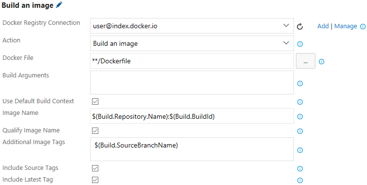
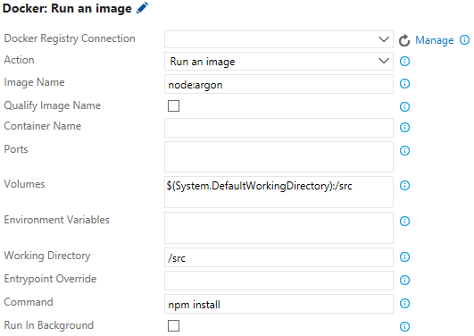
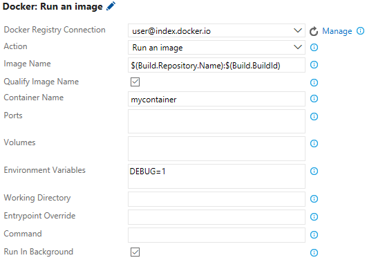
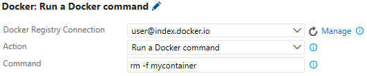
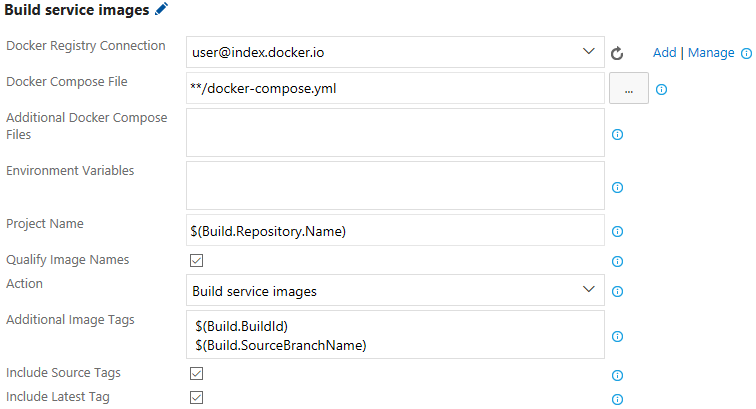
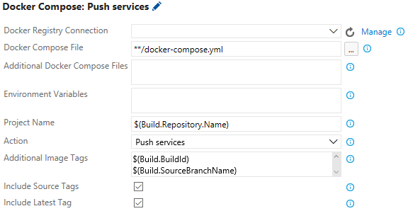
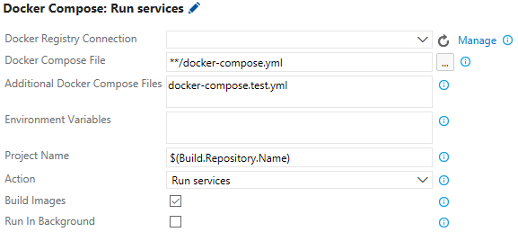
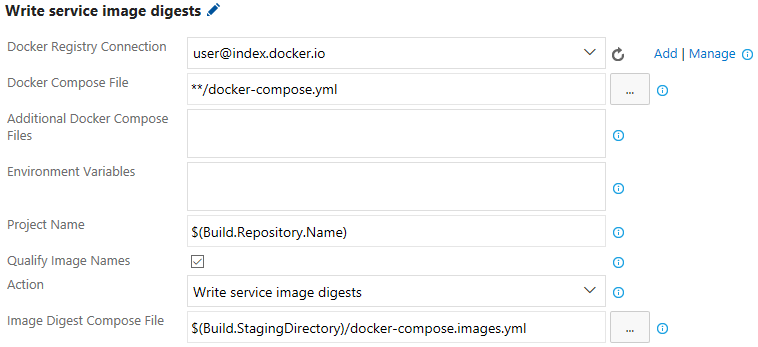
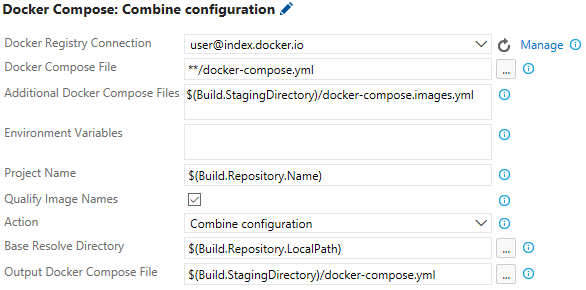
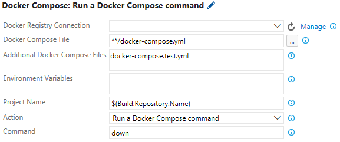

The world's largest enterprises rely on Docker to develop the world’s best applications. With the Docker extension, you can integrate Docker images and containers into your existing agile and DevOps workflows.

The Docker extension adds a task that enables you to build Docker images, push Docker images to an authenticated Docker registry, run Docker images or execute any other operation offered by the Docker CLI. It also adds a Docker Compose task that enables you to build, push and run multi-container Docker applications or execute any other operation offered by the Docker Compose CLI.

The Docker extension introduces two new service endpoints for Docker hosts and registries. The tasks default to using a local Docker host if available (this currently requires a custom VSTS agent), otherwise they require a Docker Host connection to be provided. Actions that depend on being authenticated with a Docker registry, such as pushing an image, require a Docker Registry connection to be provided.

## Build Docker Images
Easily build a Dockerfile into an image with a specific name with multiple tags, such as the build ID, source branch name or Git tags:



## Push Docker Images
Push Docker images with multiple tags to an authenticated Docker Registry and save the resulting repository image digest to a file:


> NOTE: As opposed to docker name:tag references, which may change over time, a repository image digest provides the underlying identifier of an image in a registry that can be used to guarantee that exactly the same image binary is deployed during release through multiple environments.

## Run Docker Images
Perform isolated workloads inside a container by running a Docker image. For instance, a repository that contains a Node.JS application can install a set of node modules into the repository using the node:argon image:



Docker images can also be run in the background to enable subsequent tasks to communicate with them:



> NOTE: When Docker images are run in the background, a subsequent task should be used to stop the container so that it does not persist beyond the lifetime of the build or release. This task should set its control options to "Continue on error" and "Always run" to ensure that even if another task fails, it still cleans up the running container.

## Run Docker commands
Issue arbitrary Docker commands, such as stopping containers that were previously started using the Docker Run action:



## Multi-Container Docker applications
A multi-container Docker application is a set of related services that are built, pushed and deployed as a group. They are defined using one or more docker-compose.yml files which can be combined together in a particular order to produce an effective configuration.

### Build Services
Easily build a docker-compose.yml file into a set of service images named in accordance with the image name:tag values in the compose file, as well as with additional tags, such as the build ID, source branch name or Git tags:



In this example, if the docker compose file contains two services, `service-a` and `service-b`, with image names like `sample-app/service-a` and `sample-app/service-b:v1.2`, then the resulting images will be tagged as follows:

- `sample-app/service-a`
- `sample-app/service-a:<build id>`
- `sample-app/service-a:<source branch name>`
- `sample-app/service-b:v1.2`
- `sample-app/service-b:<build id>`
- `sample-app/service-b:<source branch name>`
- `sample-app/service-b`

### Push Services
Push a set of service images defined by a docker-compose.yml file, with multiple tags, to an authenticated Docker Registry:



### Run Services
Docker compose files can be brought "up" to run one or more services in an isolated environment to enable workloads such as integration testing:



In this example, the docker-compose.test.yml file, which sits alongside the identified docker-compose.yml file, contains an additional integration test service that performs its testing by calling into the other services defined in the original docker-compose.yml file. Since "Run in Background" is unchecked, when the test container exits, the other services are brought down and the task ends. If "Run In Background" is checked, the services remain up for additional tasks that may want to call into the running services. In this case, an additional task should be used to bring down the running services (see the last section about issuing arbitrary Docker Compose commands).

### Write Service Image Digests
Produce an image digest compose file that contains the specific repository image digests of a set of service images identified by an input docker-compose.yml file:



In this example, if the docker compose file contains two services, `service-a` and `service-b`, with image names like `sample-app/service-a` and `sample-app/service-b:v1.2`, then the resulting image digest compose file would look like this:

```
version: '2'
services:
  service-a:
    image: 'sample-app/service-a@sha256:a108925595bae8f536277e8e08cb7f472422cd118d9451ff4c3c0e32a148095f'
  service-b:
    image: 'sample-app/service-b@sha256:2ca9a72f7ec08e6c4ad25b306c239579742d91afebca11afc672255d8ed949e2'
```

> NOTE: As opposed to docker name:tag references, which may change over time, a repository image digest provides the underlying identifier of an image in a registry that can be used to guarantee that exactly the same image binary is deployed during release through multiple environments.

### Combine Configuration
Combine the configuration from multiple docker compose files to create a merged docker compose file for input to a release or other tasks:



This example illustrates how an original docker-compose.yml is combined with a previously generated image digest compose file to produce a final docker compose file that equals the original content except that the image names have been overridden with the repository image digests.

### Run Docker Compose commands
Issue arbitrary Docker Compose commands, such as bringing down containers that were previously started using the Docker Compose Run services action:



## Authenticate with a Docker Registry
Actions that require authentication with a Docker Registry, whether specific credentials to the official Docker Hub or to another private registry, can be enabled by configuring a Docker Registry connection. To create a Docker Registry endpoint:

 1. Open the Services page in your Visual Studio Team Services Control Panel

    

 2. In the New Service Endpoint list, choose Registry

    

    

 3. Enter the Name for your connection and your Docker Hub details to create the service endpoint

    

## Connect to a custom Docker Host
When a VSTS agent does not have local access to a Docker host, a custom Docker host must be provided. To create a Docker Host endpoint:

 1. Locate your ca.pem, key.pem and cert.pem files used to secure your Docker host.

 2. Open the Services page in your Visual Studio Team Services Control Panel.

    

 3. In the New Service Endpoint list, choose Docker Host

    
  
    

 4. Enter the Name for your connection and the URL to your Docker host

 5. Copy and paste the entire contents of each file into the appropriate spaces

    

## Requirements
  * Visual Studio Team Services is required, or for on-premises installations, Team Foundation Server 2015 Update 3 or later.
  * A VSTS agent that has the Docker binaries. An easy way to create one of these is to use Docker to run the VSTS agent. See [https://hub.docker.com/r/microsoft/vsts-agent] for more information.

## Contact Information
For further information or to resolve issues, contact RM_Customer_Queries at Microsoft dot com.

## Trademarks
Docker and the Docker logo are trademarks or registered trademarks of Docker, Inc. in the United States and/or other countries. Docker, Inc. and other parties may also have trademark rights in other terms used herein
